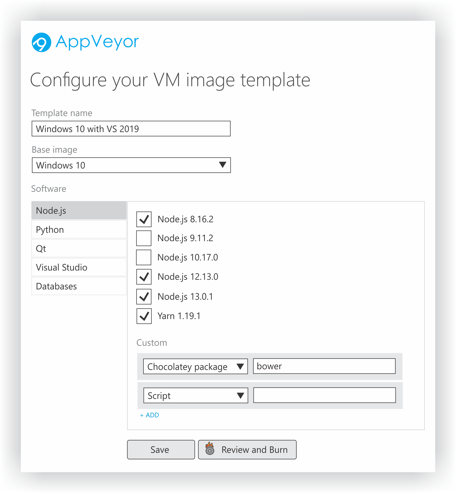
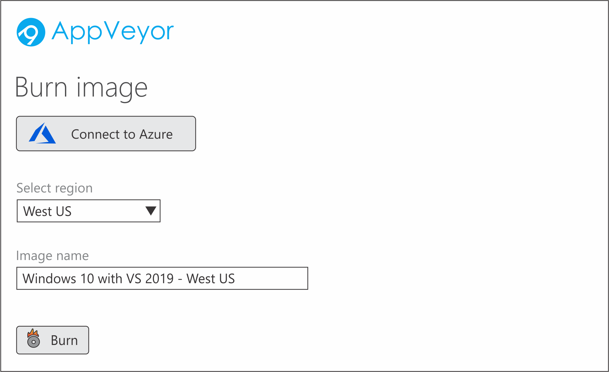

# AppVeyor Action

Configure custom VM image in AppVeyor and run CI/CD workflow in your Azure cloud on demand.

Benefits:

* Configure custom VM image on UI and apply updates easily
* Network firewall with your rules, VPN connections and IP addresses
* Run builds in your region and on your VM sizes
* VMs are created and decommissioned on demand, pay only for what you use
* Unlimited pipelines, jobs, users

## Usage

### Step 1 - Configure your VM image template in AppVeyor

### Step 2 - Burn your image in the selected Azure region

### Step 3 - Monitor image baking progress

[ screen ]

### Step 4 - Use the Action to run builds on your image

[ screen ]
